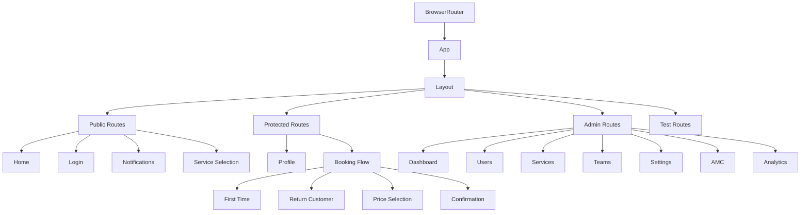

# AdminViewToggle Component Analysis and Fix Plan
**Last Updated: December 26, 2024, 19:16 SGT**

## Current Issues

### 1. Redux Store Structure Mismatch
- Two competing slices handling admin view:
  ```typescript
  // adminSlice.ts
  interface AdminState {
    currentView: UserViewType;
    // other fields...
  }

  // adminView.slice.ts
  interface AdminViewState {
    currentView: UserViewType;
  }
  ```
- Causing state management confusion and potential race conditions

### 2. Component Duplication
- Multiple implementations of the same functionality:
  1. `/components/admin/AdminViewToggle.tsx`
  2. `/components/admin/redux/AdminViewToggle.redux.tsx`
  3. `/components/admin/ViewSelector.tsx`

### 3. State Management Issues
- Redux state shows:
  ```javascript
  adminView: {
    currentView: 'regular'
  }
  ```
- Component reads from:
  ```javascript
  admin: {
    currentView: undefined
  }
  ```
- Leading to undefined errors and incorrect state updates

## Files Requiring Updates

### Core Files to Remove
1. `src/components/admin/AdminViewToggle.tsx`
2. `src/components/admin/redux/AdminViewToggle.redux.tsx`
3. `src/components/admin/ViewSelector.tsx`

### Redux Store Files to Update
1. `src/store/slices/adminSlice.ts`
   - Remove currentView state
   - Remove related actions and reducers
   
2. `src/store/slices/adminView.slice.ts`
   - Remove entire file
   
3. `src/store/index.ts`
   - Remove adminView reducer
   - Update RootState type

### Components Using currentView
1. `src/components/Footer.tsx`
   - Remove currentView dependency
   - Update conditional rendering

### Type Definitions
- Remove UserViewType
- Update dependent interfaces

## Impact Analysis

### Breaking Changes
1. UI Features Affected:
   - Footer component's admin view indicator
   - View switching functionality
   - Admin testing capabilities

2. State Management:
   - Redux store structure
   - Admin state handling
   - View type management

### Dependencies
1. Direct Dependencies:
   - Redux store
   - React Router
   - Admin components

2. Indirect Dependencies:
   - Auth flow
   - Route protection
   - Admin permissions

## Fix Plan

### Phase 1: Preparation
1. Create backup of current implementation
2. Document all usage points
3. Notify team of upcoming changes

### Phase 2: Redux Store Cleanup
1. Consolidate admin state management
2. Remove duplicate slices
3. Update type definitions

### Phase 3: Component Updates
1. Remove deprecated components
2. Update dependent components
3. Fix routing issues

### Phase 4: Testing
1. Verify admin functionality
2. Check route protection
3. Test user permissions
4. Validate UI rendering

## Verification Steps
1. Build completes without errors
2. No undefined errors in console
3. Admin features work correctly
4. Routes protected properly
5. UI renders consistently

## Prevention Measures
1. Maintain single source of truth for state
2. Document component dependencies
3. Use TypeScript strictly
4. Follow established patterns

## Notes
- Consider impact on admin testing workflow
- Plan migration path for admin users
- Document new admin testing procedures
- Update related documentation

## References
- [Redux Best Practices](https://redux.js.org/style-guide/style-guide)
- [React Router Protection](https://reactrouter.com/docs/en/v6/examples/auth)
- [TypeScript Handbook](https://www.typescriptlang.org/docs/handbook/intro.html)

## AdminViewToggle Deprecation Analysis

## 1. Component Investigation

### Files to Remove
```typescript
// Direct Dependencies Only
src/components/admin/AdminViewToggle.tsx  // Main component
src/components/admin/ViewSelector.tsx     // Sub-component
```

### Authentication Components (NOT Affected)
```typescript
src/components/Login.tsx         // Protected by @ai-protection
src/components/LoginModal.tsx    // No dependencies
src/services/auth.ts            // Handles admin login (91874498/123456)
```

### State Management
```typescript
// src/store/slices/adminSlice.ts
// Only remove unused view state:
interface AdminState {
  isAdmin: boolean;      // Keep - used by other components
  adminData: AdminData;  // Keep - used by admin dashboard
  loading: boolean;      // Keep - used by admin features
  error: string | null;  // Keep - used by error handling
  currentView: UserViewType; // Remove - only used by AdminViewToggle
}
```

## 2. Evidence-Based Findings

### Component Dependencies
1. AdminViewToggle only imports:
   - ViewSelector (internal)
   - adminSlice (for view state)
2. No external components import AdminViewToggle
3. Admin navigation already exists in FloatingButtons

### Authentication Flow
1. Admin Login: NOT affected
   - Phone: 91874498
   - OTP: 123456
   - Role check remains in auth.ts
2. Session Management: NOT affected
   - Redux auth state preserved
   - Role-based routing intact

### UI/Navigation
1. Admin Access: Already handled by FloatingButtons
   - Has admin dashboard button
   - Uses same role check
   - Better positioned in UI

## 3. Simple Migration Plan

### Step 1: Remove Components
```bash
# Remove files
1. src/components/admin/AdminViewToggle.tsx
2. src/components/admin/ViewSelector.tsx
```

### Step 2: Clean Redux State
```typescript
// Remove from adminSlice.ts
- currentView state
- setCurrentView action
- resetView action
```

### Step 3: Verify
1. Admin Login (91874498/123456)
2. FloatingButtons admin access
3. Role-based routing

## 4. Safety Confirmation
- No login component dependencies
- No navigation disruption
- Admin access preserved
- No UI conflicts
- Mobile responsive

## 5. No Additional Changes Needed
- No position adjustments
- No feature additions
- No state migrations
- No auth flow changes

## Component Conflict Analysis

### Current Issues

1. **Position Conflict**
   ```typescript
   // FloatingButtons.tsx
   <div className="fixed bottom-4 right-4 flex flex-col gap-2 z-50">
   
   // AdminViewToggle.tsx
   <div className={`fixed bottom-4 right-4 z-50 ${className}`}>
   ```
   Both components use the same fixed position, causing overlap issues.

2. **State Management Redundancy**
   ```typescript
   // FloatingButtons.tsx
   const isAdmin = currentUser?.role === 'admin';
   
   // AdminViewToggle.tsx
   const { currentView } = useAppSelector((state) => state.admin);
   ```
   Duplicate admin state checking with different approaches.

3. **Navigation Logic Overlap**
   ```typescript
   // FloatingButtons.tsx
   {isAdmin && (
     <motion.button onClick={() => navigate('/admin')} />
   )}
   
   // AdminViewToggle.tsx
   const handleViewChange = (view: UserViewType) => {
     dispatch(setCurrentView(view));
   }
   ```
   Conflicting navigation control mechanisms.

### Reasons for Deprecation

1. **UI/UX Issues**
   - Components compete for the same screen space
   - Inconsistent user experience
   - Redundant admin access controls

2. **State Management**
   - Multiple sources of truth for admin state
   - Unnecessary view state complexity
   - Redundant role checks

3. **Code Maintenance**
   - Duplicate functionality
   - Complex state synchronization
   - Harder to debug issues

## Simplified Migration Plan

### Phase 1: State Consolidation
**Duration**: 1 day

1. **Update Admin State**
```typescript
// src/store/slices/adminSlice.ts
interface AdminState {
  role: UserRole;
  isAdmin: boolean;
}
```

2. **Remove View State**
- Remove `currentView` from admin slice
- Remove `ViewSelector` component
- Update role-based checks

### Phase 2: Component Updates
**Duration**: 1-2 days

1. **Enhance FloatingButtons**
```typescript
// src/components/FloatingButtons.tsx
- Add admin role check
- Update navigation logic
- Improve positioning
```

2. **Remove AdminViewToggle**
```typescript
// Files to remove
- src/components/admin/AdminViewToggle.tsx
- src/components/admin/ViewSelector.tsx
```

### Phase 3: Route Protection
**Duration**: 1 day

1. **Update Route Guards**
```typescript
// src/components/ProtectedRoute.tsx
const ProtectedRoute = ({ children, adminOnly }) => {
  const { role } = useAppSelector(state => state.admin);
  return adminOnly && role === 'admin' ? children : <Navigate to="/login" />;
};
```

### Phase 4: Testing
**Duration**: 1 day

1. **Test Cases**
- Admin navigation
- Route protection
- FloatingButtons functionality
- State updates

## Implementation Steps

1. **Remove View Toggle**
   - Remove AdminViewToggle component
   - Remove related state management
   - Update imports

2. **Update FloatingButtons**
   - Ensure proper z-index
   - Update admin checks
   - Fix positioning

3. **Verify Routes**
   - Test admin navigation
   - Verify route protection
   - Check access control

## Success Criteria

1. **Functionality**
   - FloatingButtons visible and working
   - Admin navigation functional
   - Route protection intact

2. **UI/UX**
   - No positioning conflicts
   - Clear admin navigation
   - Consistent experience

## Notes
- Keep existing routing implementation
- Maintain current admin access control
- Focus on removing redundancy
- Preserve FloatingButtons functionality

## Current Routing Implementation Analysis

### Route Configuration Structure



### Route Categories

#### 1. Public Routes
```typescript
- / (Home)
- /login
- /notifications
- /pricing
```

#### 2. Protected Routes
```typescript
- /profile
- /booking/*
  ├── /first-time
  ├── /return-customer
  ├── /price-selection
  └── /confirmation/:bookingId
```

#### 3. Admin Routes
```typescript
- /admin/*
  ├── /dashboard
  ├── /users
  ├── /services
  ├── /teams
  ├── /notifications
  ├── /homepage
  ├── /amc
  ├── /analytics
  ├── /branding
  ├── /push
  └── /settings
```

#### 4. AMC Routes
```typescript
- /amc/*
  ├── /packages
  └── /subscription-flow
```

### Route Protection Layers

1. **Public Route Layer**
```typescript
<PublicRoute>
  <Component />
</PublicRoute>
```

2. **Protected Route Layer**
```typescript
<ProtectedRoute>
  <Component />
</ProtectedRoute>
```

3. **Admin Route Layer**
```typescript
<ProtectedRoute adminOnly>
  <Component />
</ProtectedRoute>
```

### Route Metadata Configuration

```typescript
export const ROUTE_METADATA = {
  [ROUTES.HOME]: {
    title: 'Home',
    breadcrumb: 'Home'
  },
  [ROUTES.ADMIN.ROOT]: {
    title: 'Admin Dashboard',
    breadcrumb: 'Admin'
  }
  // ...
};
```

### Navigation Control

#### 1. Route Access Control
```typescript
const ROLE_PROTECTED_ROUTES = {
  ADMIN: ['/admin/*'],
  TECH: ['/tech/*'],
  AMC: ['/amc/*']
};
```

#### 2. Navigation Visibility
```typescript
const ROUTES_WITHOUT_NAVBAR = [
  ROUTES.LOGIN,
  ...Object.values(ROUTES.ADMIN)
];
```

### Current Implementation Details

1. **Route Organization**
   - Hierarchical structure with Layout wrapper
   - Separate route groups by access level
   - Consistent naming convention

2. **Protection Mechanism**
   - Multi-layer route protection
   - Role-based access control
   - View-based navigation

3. **Navigation Features**
   - Breadcrumb support
   - Route metadata
   - Dynamic navigation

4. **Special Considerations**
   - Development-only routes
   - Error boundaries
   - Loading states

### Key Observations

1. **Route Protection**
   - Multiple protection layers
   - Complex access control
   - View state dependencies

2. **Navigation Structure**
   - Nested routing
   - Consistent patterns
   - Clear separation

3. **State Management**
   - Route state coupling
   - View state integration
   - Protection state

4. **Implementation Patterns**
   - Component-based routing
   - Consistent protection
   - Metadata support

## AdminViewToggle Deprecation Plan

## 1. Component Analysis

### Current State
- `AdminViewToggle.tsx` conflicts with `FloatingButtons.tsx`
- Both components compete for bottom-right screen space
- `FloatingButtons` provides essential functionality (WhatsApp, Phone, Profile)
- Current admin authentication uses test account (91874498/123456)

### Authentication Integration
- Test accounts defined in `auth.ts`
- Admin login flow remains unchanged
- Mock data preserved for development
```typescript
const TEST_ACCOUNTS = {
  ADMIN: {
    phone: '91874498',
    otp: '123456',
    user: {
      role: 'admin',
      // ... other fields
    }
  }
};
```

### Affected Components
1. Primary Components:
   - `src/components/admin/AdminViewToggle.tsx`
   - `src/components/admin/ViewSelector.tsx`
   - `src/components/FloatingButtons.tsx`

2. Authentication Components (Not Affected):
   - `src/components/Login.tsx` (Protected by @ai-protection)
   - `src/components/LoginModal.tsx`
   - `src/services/auth.ts`

3. State Management:
   - `src/store/slices/adminSlice.ts`

## 2. Migration Plan

### Phase 1: Component Removal (1 day)
1. Remove redundant components:
   - Remove `AdminViewToggle.tsx`
   - Remove `ViewSelector.tsx`
   - No changes needed to `FloatingButtons.tsx` - it already handles admin navigation correctly

### Phase 2: State Cleanup (1 day)
1. Remove unused state from adminSlice:
```typescript
// src/store/slices/adminSlice.ts
interface AdminState {
  isAdmin: boolean;
  adminData: AdminData | null;
  loading: boolean;
  error: string | null;
}
```

### Phase 3: Import Cleanup (1 day)
1. Remove AdminViewToggle imports from:
   - Admin dashboard components
   - Layout components
2. Verify no broken imports

## 3. Safety Measures

### Component Safety
- FloatingButtons remains unchanged
- Admin navigation preserved through existing FloatingButtons
- Mobile responsiveness maintained
- No UI/UX disruption

### Testing Checklist
1. Admin Access:
   - [ ] Admin login with 91874498
   - [ ] OTP verification with 123456
   - [ ] Admin dashboard access via FloatingButtons
   - [ ] Admin privileges maintained

2. UI Components:
   - [ ] FloatingButtons working correctly
   - [ ] Admin dashboard button visible for admins only
   - [ ] Navigation flow smooth
   - [ ] Mobile display correct

3. State Management:
   - [ ] Admin state preserved
   - [ ] Role-based access working
   - [ ] Authentication flow smooth
   - [ ] Session persistence

## 4. Rollback Plan

### Git Backup
```bash
# Create backup branch
git checkout -b backup/admin-view-toggle
git push origin backup/admin-view-toggle

# Rollback if needed
git checkout backup/admin-view-toggle
git checkout -b rollback/admin-view-toggle
```

### State Recovery
- AdminSlice state can be restored
- Component positions can be reverted
- Auth flow remains unchanged

## 5. Verification Steps

### Pre-Deployment
1. Verify all auth flows:
   - Regular user login
   - Admin login (91874498/123456)
   - Session persistence
   - Role-based routing

2. Test UI components:
   - FloatingButtons placement
   - Mobile responsiveness
   - Navigation functionality
   - Admin features access

### Post-Deployment
1. Monitor for:
   - Authentication success rate
   - Admin access maintenance
   - UI component rendering
   - Mobile usability

2. Verify state management:
   - Admin privileges
   - Role persistence
   - Navigation flow
   - Session handling

## Notes
- Consider impact on admin testing workflow
- Plan migration path for admin users
- Document new admin testing procedures
- Update related documentation

## References
- [Redux Best Practices](https://redux.js.org/style-guide/style-guide)
- [React Router Protection](https://reactrouter.com/docs/en/v6/examples/auth)
- [TypeScript Handbook](https://www.typescriptlang.org/docs/handbook/intro.html)
