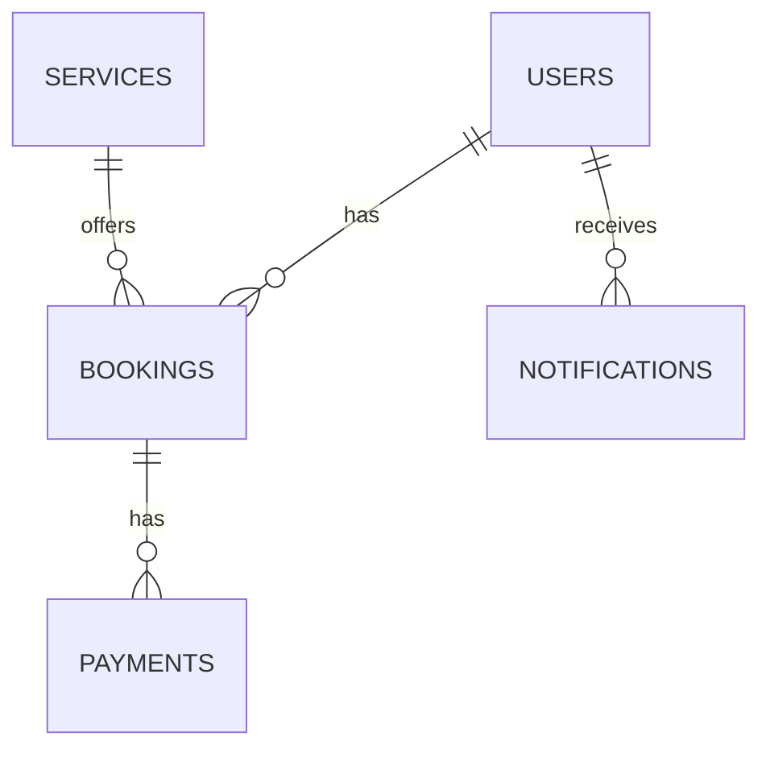

# Project Structure Documentation

## 1. Project Overview
### Description
iAircon EasyBooking is a comprehensive aircon servicing and maintenance booking platform built with modern web technologies.

### Key Features
- User authentication and authorization
- Service booking management
- Payment processing with Stripe integration
- Real-time notifications
- Admin dashboard for service management
- Progressive Web App capabilities

### Technology Stack
- **Frontend**: React, Vite, TailwindCSS
- **Backend**: Node.js, Express, Prisma
- **Database**: PostgreSQL with Supabase
- **Testing**: Vitest, Testing Library
- **CI/CD**: GitHub Actions

## 2. Directory Structure
```
project-redux/
├── api/               # API endpoints
├── prisma/            # Database schema and migrations
├── public/            # Static assets
├── src/               # Frontend source code
│   ├── components/    # Reusable UI components
│   ├── hooks/         # Custom React hooks
│   ├── services/      # API service layer
│   ├── store/         # Redux state management
│   ├── types/         # TypeScript type definitions
│   └── utils/         # Utility functions
├── tests/             # Test files
└── docs/              # Project documentation
```

## 3. Core Modules
### Authentication
- JWT-based authentication
- Role-based access control
- Passwordless login options
- Session management

### Booking System
- Service selection and scheduling
- Real-time availability
- Booking confirmation flow
- Customer notifications

### Payment Processing
- Stripe integration
- Payment intent creation
- Webhook handling
- Receipt generation

### Notification System
- Real-time updates
- Email and SMS notifications
- User preference management
- Notification history

### Admin Dashboard
- Service management
- User administration
- Analytics and reporting
- System configuration

## 4. Database Schema
### Key Entities
- Users
- Services
- Bookings
- Payments
- Notifications

### Relationships


### Security Model
- Row-level security
- Encrypted sensitive data
- Audit logging
- Rate limiting

## 5. API Architecture
### REST Endpoints
- Authentication: `/api/auth/*`
- Bookings: `/api/bookings/*`
- Payments: `/api/payments/*`
- Services: `/api/services/*`

### Authentication Flow
1. User login
2. JWT token generation
3. Token validation middleware
4. Role-based access control

### Error Handling
- Standardized error responses
- HTTP status codes
- Error logging
- Client-friendly messages

### Rate Limiting
- IP-based rate limiting
- API key authentication
- Request throttling
- Abuse detection

## 6. Frontend Architecture
### Component Structure
- Atomic design pattern
- Reusable UI components
- Container components
- Layout components

### State Management
- Redux Toolkit
- Slice-based architecture
- Async thunks
- Persisted state

### Routing
- React Router
- Protected routes
- Lazy loading
- Route-based code splitting

### PWA Configuration
- Service worker
- Offline capabilities
- App manifest
- Install prompt

## 7. Development Workflow
### Linting and Formatting
- ESLint configuration
- Prettier integration
- Type checking
- Import ordering

### Testing Strategy
- Unit tests
- Integration tests
- End-to-end tests
- Test coverage reporting

### CI/CD Integration
- GitHub Actions
- Automated testing
- Build verification
- Deployment pipelines

## 8. Deployment Configuration
### Environment Variables
- Development
- Staging
- Production

### Build Process
- Vite build configuration
- Code splitting
- Tree shaking
- Source maps

### Server Configuration
- Express server
- Rate limiting
- Security headers
- Compression

### Monitoring
- Error tracking
- Performance monitoring
- Log aggregation
- Alerting