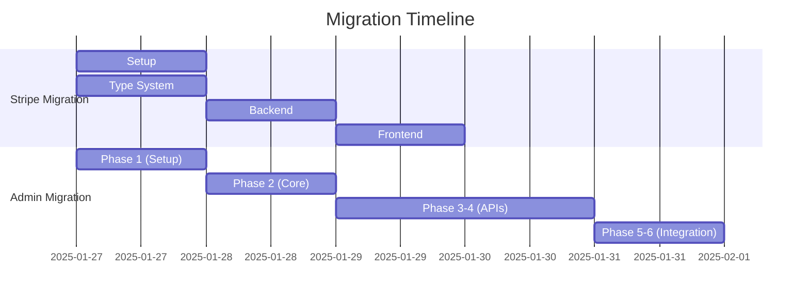

# Backend Reorganization Plan for Vercel Deployment - Stripe Checkout Integration

Created: January 25, 2025, 6:00 PM (UTC+8)
Last Updated: January 27, 2025, 7:22 AM (UTC+8)

## 0. Parallel Execution Strategy

### 0.1 Coordination with Admin Migration

- Shared infrastructure development
- Coordinated timeline
- Resource allocation
- Feature flag strategy

### 0.2 Timeline Alignment



### 0.3 Shared Resources

1. **Infrastructure**

   - Error handling system
   - Logging service
   - CORS configuration
   - Authentication middleware

2. **Type System**

   - Share core type definitions
   - Coordinate validation strategies
   - Common error types

3. **Development Practices**
   - Feature flags for gradual rollout
   - Coordinated testing strategy
   - Shared monitoring approach

## 1. Key Migration Principles

### 1.1 Stripe Checkout Strategy

- Use Stripe Hosted Checkout only
- No direct payment processing
- Simplified payment flow
- Clear success/cancel handling

### 1.2 Type System Management

```typescript
// Centralized type definitions (shared with Admin)
shared/types/
├── core/                    # Core type definitions
│   ├── models.ts           # Base interfaces
│   └── validation.ts       # Validation types
└── domains/                # Domain-specific types
    ├── payment/            # Payment types only
    │   ├── checkout.ts     # Checkout session types
    │   └── webhook.ts      # Webhook event types
    └── admin/              # (Admin team) Admin types
```

### 1.3 Validation Strategy

- Single source of truth for type validation
- Runtime type checking for Stripe events
- Clear error boundaries (shared with Admin)
- Simplified validation interfaces

## 2. Current Structure Analysis

### 2.1 Backend Files Location

- `/src/server.ts` - Express server setup
- `/src/api/stripe.ts` - Stripe payment routes
- `/src/lib/supabase.server.ts` - Supabase server configuration

### 2.2 Affected Frontend Files

Components:

- `/src/components/booking/BookingConfirmation.tsx`
- `/src/components/booking/PaymentStep.tsx`

Hooks and Services:

- `/src/hooks/usePayment.ts`
- `/src/services/stripe.ts`

## 3. New Structure Design

```
/
├── server/                           # Backend business logic
│   ├── api/                         # API routes
│   │   └── payments/
│   │       ├── checkout.ts         # Create Stripe Checkout session
│   │       ├── success.ts          # Handle successful payment
│   │       ├── cancel.ts          # Handle cancelled payment
│   │       └── webhook.ts         # Stripe webhook handler
│   │
│   ├── config/
│   │   ├── cors.ts                # CORS configuration
│   │   └── stripe.ts              # Stripe configuration
│   │
│   ├── services/
│   │   └── stripe/
│   │       └── checkoutService.ts # Stripe Checkout session management
│   │
│   └── utils/
│       ├── error-handler.ts       # Error handling middleware
│       └── logger.ts              # Logging utility
```

### 3.1 Benefits of New Structure

1. **Simplified Flow**

   - Only Stripe Checkout session management
   - No direct payment processing
     | Clear separation of concerns

2. **Minimal Dependencies**

   - Only Stripe SDK required
   - No PDF generation
   - No receipt handling

3. **Improved Type Safety**
   - Focused on Checkout session types
   - Webhook event validation
   - Clear payment states

## 4. Migration Steps

### Phase 1: Setup (Estimated time: 30 minutes)

1. Create new directory structure
2. Set up TypeScript configurations
3. Update path aliases
4. Create placeholder files

### Phase 2: Type System Migration (Estimated time: 1 hour)

1. Create Checkout session types
2. Implement webhook event types
3. Set up error boundaries
4. Verify type coverage

### Phase 3: Backend Migration (Estimated time: 1 hour)

1. Implement checkoutService.ts
2. Create API routes
3. Set up webhook handling
4. Configure error handling

### Phase 4: Frontend Updates (Estimated time: 1 hour)

1. Update payment states
2. Implement redirect handling
3. Update API endpoints
4. Add error boundaries

## 5. Verification Checklist

### 5.1 Backend Verification

- [ ] Checkout session creation works
- [ ] Success/cancel redirects work
- [ ] Webhook handling works
- [ ] Error handling is consistent
- [ ] CORS is properly configured

### 5.2 Frontend Verification

- [ ] Redirect to Stripe Checkout works
- [ ] Success/cancel handling works
- [ ] Payment states are correct
- [ ] Error handling works
- [ ] No console errors

## 6. Dependencies and Environment Variables

### 6.1 Required Dependencies

```json
{
  "@vercel/node": "latest",
  "stripe": "^2023.10.16"
}
```

### 6.2 Environment Variables

```env
STRIPE_SECRET_KEY=
STRIPE_WEBHOOK_SECRET=
```

## 7. Type System Guidelines

### 7.1 Type Definition Rules

```typescript
// Stripe Checkout related types
interface CheckoutSession {
  id: string;
  bookingId: string;
  userId: string;
  status: CheckoutSessionStatus;
  metadata: CheckoutMetadata;
}

type CheckoutSessionStatus =
  | 'open'
  | 'complete'
  | 'expired';

interface CheckoutMetadata {
  bookingId: string;
  userId: string;
}

// Payment States
const PAYMENT_STATES = {
  INITIAL: 'INITIAL',
  REDIRECTING_TO_CHECKOUT: 'REDIRECTING_TO_CHECKOUT',
  SUCCESS: 'SUCCESS',
  ERROR: 'ERROR',
  CANCELLED: 'CANCELLED'
} as const;

type PaymentState = typeof PAYMENT_STATES[keyof typeof PAYMENT_STATES];
```

### 7.2 Error Handling

```typescript
type CheckoutError =
  | { type: 'session_creation'; message: string }
  | { type: 'webhook_verification'; message: string }
  | { type: 'session_expired'; sessionId: string };

function handleCheckoutError(error: CheckoutError): void {
  switch (error.type) {
    case 'session_creation':
      // Handle session creation errors
      break;
    case 'webhook_verification':
      // Handle webhook verification errors
      break;
    case 'session_expired':
      // Handle expired session
      break;
  }
}
```

## 8. Timeline and Coordination

### 8.1 Daily Sync Points

- Morning: Sync with Admin team on shared infrastructure
- Afternoon: Review integration points
- End of day: Progress report and blocker resolution

### 8.2 Shared Infrastructure Development

1. Day 1: Core setup and shared utilities
2. Day 2: Type system and validation
3. Day 3: API integration points
4. Day 4: Testing and verification

### 8.3 Feature Flag Strategy

- Implement gradual rollout
- Coordinate flag states with Admin team
- Monitor system health during transitions

## 9. Support and Resources

### 9.1 Documentation

- Stripe Checkout: https://stripe.com/docs/checkout/quickstart
- Vercel API Routes: https://vercel.com/docs/serverless-functions/introduction
- Stripe Webhooks: https://stripe.com/docs/webhooks

### 9.2 Testing Resources

- Stripe Test Cards
- Webhook Testing
- Frontend Testing

## 10. Coordination Checklist

### 10.1 Shared Components

- [ ] Error handling system
- [ ] Logging infrastructure
- [ ] Authentication middleware
- [ ] CORS configuration
- [ ] Type definitions

### 10.2 Integration Points

- [ ] API response formats
- [ ] Error codes
- [ ] Authentication flow
- [ ] Monitoring metrics

### 10.3 Testing Strategy

- [ ] Shared test utilities
- [ ] Integration test coordination
- [ ] Load testing approach
- [ ] Error scenario coverage

## 11. Rollback Strategy

### 11.1 Triggers

- Failed integration tests
- Performance issues
- Security concerns
- Admin migration conflicts

### 11.2 Coordination Steps

1. Immediate notification to Admin team
2. Assess impact on shared components
3. Coordinate rollback timing
4. Verify system stability post-rollback

## 12. Success Metrics

### 12.1 Technical Metrics

- All tests passing
- Performance within SLA
- No security issues
- Clean integration with Admin components

### 12.2 Business Metrics

- Successful payment processing
- Error rates within threshold
- Admin dashboard integration working
- Monitoring alerts configured
